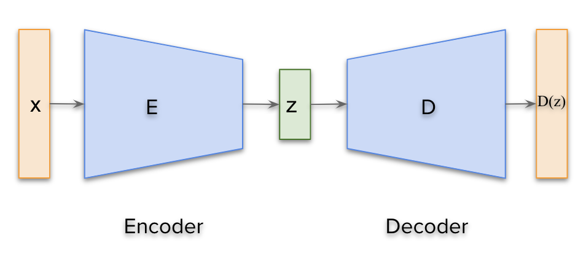
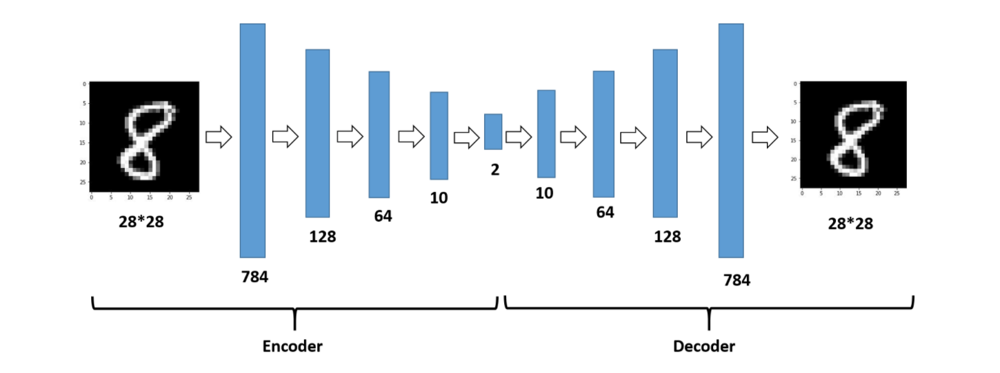

## Stacked Autoencoder Implementation
This repository is about Stacked AutoEncoder in Tensorflow 2 , I used tf.keras.Model and tf.layers.Layer instead of tf.keras.models.Sequential.  This allows us to customize and have full control of the model, I also used custom training instead of relying on the fit() function.  
In case we have very huge dataset, I applied online loading (by batch) instead of loading the data completely at the beginning. This will eventually not consume the memory.  

#### AutoEncoder Architecrure      
<p></p>    
<center>  

</center>    

#### The Architecrure of Stacked Autoencoder
<p></p>   
<center>   

</center>   

Figure 1: image is taken from [source](https://towardsdatascience.com/applied-deep-learning-part-3-autoencoders-1c083af4d798)


<center>    
    
</center>    

Figure 2: image is taken from [source](https://github.com/ALPHAYA-Japan/autoencoder/blob/master/README.md)


### Training on MNIST
<p></p>
<center>

</center>

### Requirement
```
python==3.7.0
numpy==1.18.1
```
### How to use
Training & Prediction can be run as follows:    
`python train.py train`  
`python train.py predict img.png`  


### More information
* Please refer to the original paper of Stacked AutoEncoder [here](https://arxiv.org/pdf/1907.03278.pdf)   

### Implementation Notes
* **Note 1**:   
Since datasets are somehow huge and painfully slow in training ,I decided to make number of units variable. If you want to run it in your PC, you can reduce or increase the number of units into any number you like. (512 is by default). For example:  
`model = stacked_ae.Stacked_Ae((None,height, width, channel), latent = 100, units = 512)`

* **Note 2** :   
You can also make the size of images smaller, so that it can be ran faster and doesn't take too much memories.

### Result for MNIST:   
* Learning rate = 0.0001
* Batch size = 16  
* Optimizer = Adam   
* units=2
* latent = 200

Epochs | Training Loss |  Validation Loss  |
:---: | :---: | :---:
1 | 0.0518| 0.0424
10 | 0.03328 | 0.03278
20 | 0.0298| 0.0299

Epoch | True image and predicted image
:---: | :---:
1 | 
10 | 
20 |
